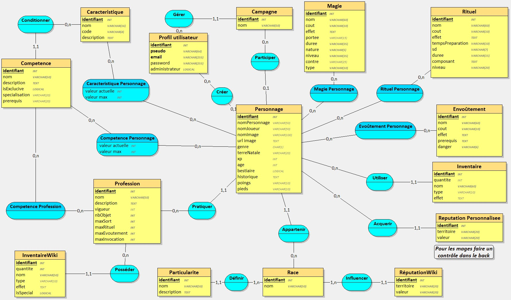

### Menu
* [Accueil](_accueil.md)
* [Etapes de développement](_etape_dev.md)
* [Cas d'usage](_uc.md)
* [Définitions](_definition.md)
* [Règles création fiche perso](_creer_fiche_perso.md)

## Étapes de développement


|       N°        | Description                                                                                                                                     | Date       |   Etat   |
|:---------------:|:------------------------------------------------------------------------------------------------------------------------------------------------|:-----------|:--------:|
|  [0](#etape-0)  | - Revoir de MDC<br/>- Mettre en place les différentes tâches <br/>- Créer un jeux de donnée                                                     | 01/12/2024 |    ok    |
|  [1](#etape-1)  | - Faire le CRUD pour la partie wiki                                                                                                             | 22/12/2024 |    ok    |
|  [2](#etape-2)  | - Faire le CRUD pour la partie personnage                                                                                                       | 05/01/2025 | en cours |
|  [3](#etape-3)  | - Connecter le back à la BDD<br/>- Faire la partie connexion/déconnexion avec un rôle admin et utilisateur<br/>- Redirection vers la bonne page | 02/02/2025 |    ok    |
|  [4](#etape-4)  | - Coder la partie front afin d'avoir un visuel de base puis le connecter au back                                                                | 23/02/2025 |    ok    |
|  [5](#etape-5)  | - Modification et création d'un profil                                                                                                          |            | a faire  |
|  [6](#etape-6)  | - Préparer la structure d'un nouvelle API spécifique au Magasin                                                                                 |            |          |
|  [7](#etape-7)  | - Gestion et consultation des marchandises                                                                                                      |            |          |
|  [8](#etape-8)  | - Ajouter l'inventaire dans la fiche personnage                                                                                                 |            |          |
|  [9](#etape-9)  | - Faire de CRUD des PNJ (extend fiche perso)<br/>- Duplication PJ & PNJ                                                                         |            |          |
| [10](#etape-10) | - Modification des stats en fonction de l'équipement                                                                                            |            |          |
| [11](#etape-11) | - Calcul des tests (lancés de dé)                                                                                                               |            |          |

## Précisions sur les Étapes

### <a name="etape-0"></a>Étapes 0

Schema merise : 


Script SQL :

```sql
CREATE TABLE magie(
    idMagie INT,
    nom VARCHAR(60) NOT NULL,
    cout VARCHAR(10) NOT NULL,
    effet TEXT NOT NULL,
    portee VARCHAR(10) NOT NULL,
    duree VARCHAR(10) NOT NULL,
    elementaire VARCHAR(5) NOT NULL,
    niveau VARCHAR(20) NOT NULL,
    contre VARCHAR(20),
    profession VARCHAR(9) NOT NULL,
    PRIMARY KEY(idMagie)
);

CREATE TABLE caracteristique(
    idCaractéristique INT,
    nom VARCHAR(16) NOT NULL,
    code VARCHAR(4) NOT NULL,
    description TEXT NOT NULL,
    PRIMARY KEY(idCaractéristique)
);

CREATE TABLE _user(
    idUser INT,
    pseudo VARCHAR(64) NOT NULL,
    email VARCHAR(255) NOT NULL,
    password VARCHAR(255) NOT NULL,
    isAdmin LOGICAL default false,
    PRIMARY KEY(idUser),
    UNIQUE(pseudo),
    UNIQUE(email)
);

CREATE TABLE rituel(
    idRituel INT,
    nom VARCHAR(60) NOT NULL,
    cout VARCHAR(10) NOT NULL,
    effet TEXT NOT NULL,
    TempsPreparation INT NOT NULL,
    sd VARCHAR(7) NOT NULL,
    duree VARCHAR(10) NOT NULL,
    composant TEXT NOT NULL,
    niveau VARCHAR(20) NOT NULL,
    PRIMARY KEY(idRituel)
);

CREATE TABLE envoutement(
    idEnvoutement INT,
    nom VARCHAR(60) NOT NULL,
    cout VARCHAR(10) NOT NULL,
    effet TEXT NOT NULL,
    prerequis TEXT NOT NULL,
    danger VARCHAR(6) NOT NULL,
    PRIMARY KEY(idEnvoutement)
);

CREATE TABLE profession(
    idProfession INT,
    nom VARCHAR(50) NOT NULL,
    description TEXT NOT NULL,
    PRIMARY KEY(idProfession)
);

CREATE TABLE race(
    idRace INT,
    nom VARCHAR(50) NOT NULL,
    PRIMARY KEY(idRace)
);

CREATE TABLE reputationWiki(
    idReputation INT,
    territoire VARCHAR(20) NOT NULL,
    valeur VARCHAR(20) NOT NULL,
    idRace INT NOT NULL,
    PRIMARY KEY(idReputation),
    FOREIGN KEY(idRace) REFERENCES race(idRace)
);

CREATE TABLE particularite(
    idRace INT,
    nom VARCHAR(50) NOT NULL,
    description TEXT NOT NULL,
    idRace_1 INT NOT NULL,
    PRIMARY KEY(idRace),
    FOREIGN KEY(idRace_1) REFERENCES race(idRace)
);

CREATE TABLE campagne(
    idCampagne INT,
    nom VARCHAR(50) NOT NULL,
    uId TEXT NOT NULL,
    password TEXT,
    idUser INT NOT NULL,
    PRIMARY KEY(idCampagne),
    UNIQUE(uId),
    FOREIGN KEY(idUser) REFERENCES _user(idUser)
);

CREATE TABLE competence(
    idCompetenceSpecifique INT,
    nom VARCHAR(50) NOT NULL,
    description TEXT NOT NULL,
    specialisation VARCHAR(20) NOT NULL,
    prerequis VARCHAR(20),
    exclusif LOGICAL NOT NULL,
    idCaractéristique INT NOT NULL,
    idProfession INT NOT NULL,
    PRIMARY KEY(idCompetenceSpecifique),
    FOREIGN KEY(idCaractéristique) REFERENCES caracteristique(idCaractéristique),
    FOREIGN KEY(idProfession) REFERENCES profession(idProfession)
);

CREATE TABLE personnage(
    idPersonnage INT,
    nomPersonnage VARCHAR(50),
    nomJoueur VARCHAR(50),
    nomImage VARCHAR(100),
    urlImage TEXT,
    genre CHAR(1),
    terreNatale VARCHAR(20),
    xp INT,
    age INT,
    bestiaire LOGICAL default false,
    historique TEXT,
    idProfession INT NOT NULL,
    idRace INT NOT NULL,
    idCampagne INT,
    idUser INT,
    PRIMARY KEY(idPersonnage),
    FOREIGN KEY(idProfession) REFERENCES profession(idProfession),
    FOREIGN KEY(idRace) REFERENCES race(idRace),
    FOREIGN KEY(idCampagne) REFERENCES campagne(idCampagne),
    FOREIGN KEY(idUser) REFERENCES _user(idUser)
);

CREATE TABLE inventaire(
    idEnvoutement INT,
    nom VARCHAR(60) NOT NULL,
    type VARCHAR(10),
    effet TEXT,
    quantité INT,
    idPersonnage INT NOT NULL,
    PRIMARY KEY(idEnvoutement),
    FOREIGN KEY(idPersonnage) REFERENCES personnage(idPersonnage)
);

CREATE TABLE caracteristique_personnage(
    idCaracteristiquePersonnage INT,
    valeurActuelle INT NOT NULL,
    valeurMax INT NOT NULL,
    idPersonnage INT NOT NULL,
    idCaractéristique INT NOT NULL,
    PRIMARY KEY(idCaracteristiquePersonnage),
    FOREIGN KEY(idPersonnage) REFERENCES personnage(idPersonnage),
    FOREIGN KEY(idCaractéristique) REFERENCES caracteristique(idCaractéristique)
);

CREATE TABLE reputationPersonnalisee(
    idReputation INT,
    territoire VARCHAR(20) NOT NULL,
    valeur VARCHAR(20) NOT NULL,
    idPersonnage INT NOT NULL,
    PRIMARY KEY(idReputation),
    FOREIGN KEY(idPersonnage) REFERENCES personnage(idPersonnage)
);

CREATE TABLE competence_personnage(
    idCaracteristiquePersonnage INT,
    valeurActuelle INT NOT NULL,
    valeurMax INT NOT NULL,
    idPersonnage INT NOT NULL,
    idCompetenceSpecifique INT NOT NULL,
    PRIMARY KEY(idCaracteristiquePersonnage),
    FOREIGN KEY(idPersonnage) REFERENCES personnage(idPersonnage),
    FOREIGN KEY(idCompetenceSpecifique) REFERENCES competence(idCompetenceSpecifique)
);

CREATE TABLE magie_personnage(
    idPersonnage INT,
    idMagie INT,
    PRIMARY KEY(idPersonnage, idMagie),
    FOREIGN KEY(idPersonnage) REFERENCES personnage(idPersonnage),
    FOREIGN KEY(idMagie) REFERENCES magie(idMagie)
);

CREATE TABLE rituel_personnage(
    idPersonnage INT,
    idRituel INT,
    PRIMARY KEY(idPersonnage, idRituel),
    FOREIGN KEY(idPersonnage) REFERENCES personnage(idPersonnage),
    FOREIGN KEY(idRituel) REFERENCES rituel(idRituel)
);

CREATE TABLE envoutement_personnage(
   idPersonnage INT,
   idEnvoutement INT,
   PRIMARY KEY(idPersonnage, idEnvoutement),
   FOREIGN KEY(idPersonnage) REFERENCES personnage(idPersonnage),
   FOREIGN KEY(idEnvoutement) REFERENCES envoutement(idEnvoutement)
);

```

  
Liste des tables et leur description :

|         NOM TABLE          | Description                                                                                                                       |
|:--------------------------:|:----------------------------------------------------------------------------------------------------------------------------------|
|            USER            | Les utilisateurs de l'application (les maîtres de jeux).<br/> Un utilisateur peut posséder 0 à n fiches de personnage.            |
|          CAMPAGNE          | Un utilisateur a la possibilité d'associer ses fiches personnages à une campagne.                                                 |
|         PERSONNAGE         | Éléments définissant un personnage avec ses origines, ses points forts, ses points faibles, etc...                                |
|           RITUEL           | Description détaillée des rituels disponibles dans le jeu.                                                                        |
|        ENVOUTEMENT         | Description détaillée des envoûtements disponibles dans le jeu.                                                                   |
|           MAGIE            | Description détaillée des signes, sorts et invocations disponibles dans le jeu.                                                   |
|        ENVOUTEMENT         | Description détaillée des envoûtements disponibles dans le jeu.                                                                   |
|         INVENTAIRE         | Liste les objets et équipements que possède le personnage (cette table sera retravaillée lors de la phase de création du magasin) |
|         HISTORIQUE         | Histoire du personnage                                                                                                            |
|            RACE            | Liste des races disponibles et de leur spécificité                                                                                |
|         PROFESSION         | Liste les métiers disponibles                                                                                                     |
|         COMPETENCE         | Compétences disponibles pour chaque personnage, ce qu'il est capable de faire ou non (exemple : négoce, survie, bagarre, ...).    |
|   COMPETENCE/PERSONNAGE    | Valeur d'une compétence donnée pour un personnage et une profession donnée.                                                       |
|      CARACTÉRISTIQUE       | Description des caractéristiques physiques du personnage, son intelligence, sa dextérité etc...                                   |
| CARACTÉRISTIQUE/PERSONNAGE | Valeur d'une caractéristique donnée pour un personnage donné.                                                                     |

Refonte du projet et travail plus poussé du schéma Merise. Puis mise en place d'un planning avec les différentes étapes.

### <a name="etape-1"></a>Étape 1

Mise en place sur la partie des JPA, du jeu de données ainsi que du CRUD pour les éléments suivants : races, **caractéristiques**, **compétences**, sorts, rituels, signes.
- Sorts, Sorts et Signes sont finalement regroupés en une seule table : Magie
- Les compétences concernent :
    - le job avec sa compétence exclusive,
    - les compétences spécifiques à un job,
    - Les compétences plus générales.

### <a name="etape-2"></a>Étapes 2

Ajout de la partie centrale d'une fiche personnage avec les règles de gestion nécessaires à la création d'une fiche personnage.

### <a name="etape-3"></a>Étapes 3

Connecter le back à la BDD (MySQL)
Deux types de compte :
- Administrateur : qui peut créer, modifier, lire, supprimer les éléments suivants : races, caractéristiques, compétences, sorts, rituels, signes, ainsi que 
 les fiches des monstres.
- Utilisateur : qui peut lire les éléments cités précédemment.
- Les deux rôles peuvent créer, modifier, lire et supprimer des campagnes et des fiches personnages visibles que par eux.

### <a name="etape-4"></a>Étapes 4

Créer la partie Front en Angular, coder dans un premier temps en dur.  
Coder en dur va permettre d'avoir un premier aperçu du visuel du site.  
Quand la partie base de donnée sera fixé de manière plus définitive, coder le reste du front.  
Brancher le back et le front au fur et à mesure de l'avancement du projet dans cet ordre :  
- la partie wiki, 
- la partie fiche personnage, 
- la connexion/déconnexion, 
- la partie magasin
- la partie lancement des tests

### <a name="etape-5"></a>Étapes 5

Permettre la modification du profil, mais aussi la création d'un nouveau compte User.
Seul un administrateur peut changer les rôles.

|      Rôle      | Droits                                                                                                                                                                                                                                                  |
|:--------------:|:--------------------------------------------------------------------------------------------------------------------------------------------------------------------------------------------------------------------------------------------------------|
| Administrateur | Droits Utilisateur et Visiteur + possibilité de créer, modifier, supprimer le wiki et peut donner les droits.                                                                                                                                           |
|  Utilisateur   | Droits Visiteur + possibilité de créer modifier supprimer des ficher personnage et PNJ/monstres visibles que par lui et de les intégrer à des campagnes. Possibilité de rendre visible pour autrui les fiches créées. Possibilité de consulter le wiki. |
|    Visiteur    | Mode déconnecté. Possibilité de consulter sur le wiki la liste des races, profession, magie, envoûtement. Possibilité de consulter une fiche personnage partagé (à l'aide de l'url) par une personne connecté.                                          |

### <a name="etape-6"></a>Étapes 6

Faire le schéma de BDD.
Préparer les différentes étapes de développement.

### <a name="etape-7"></a>Étapes 7

À faire lors de la phase 2 : Le Magasin.

### <a name="etape-8"></a>Étapes 8

À faire lors de la phase 2 : Le Magasin.

### <a name="etape-9"></a>Étapes 9

À faire lors de la phase 2 : Le Magasin.

### <a name="etape-10"></a>Étapes 10

À faire lors de la phase 2 : Le Magasin.

### <a name="etape-11"></a>Étapes 11

À faire lors de la phase 2 : Le Magasin.
